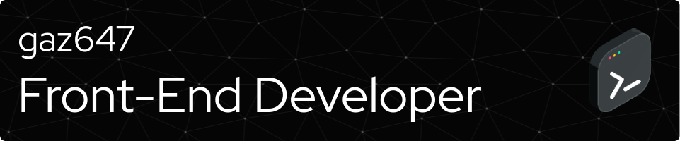
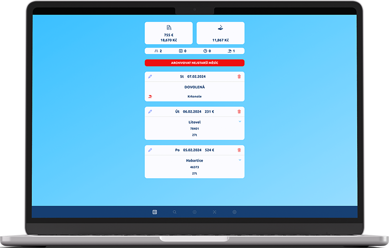
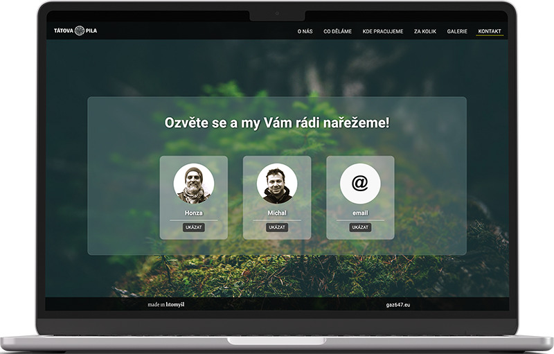
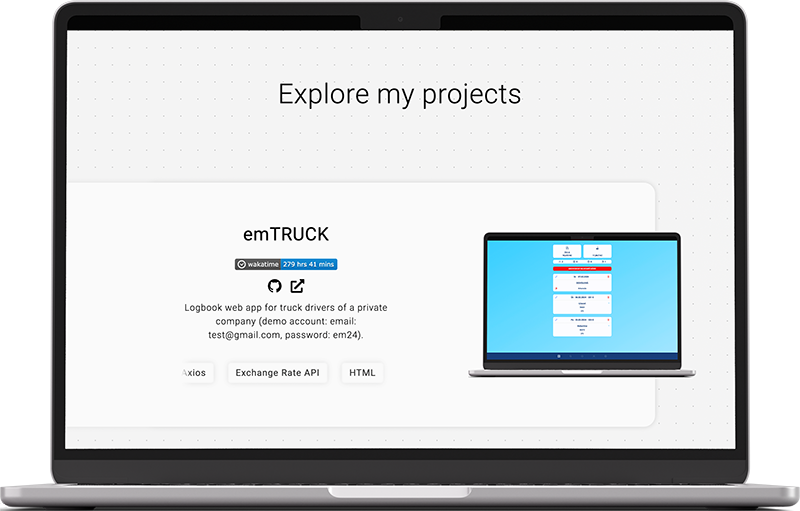
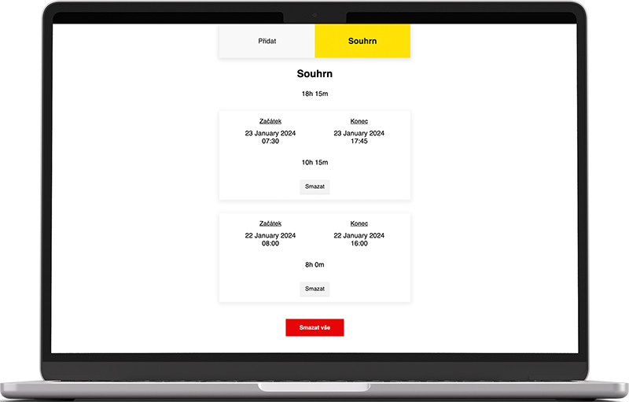
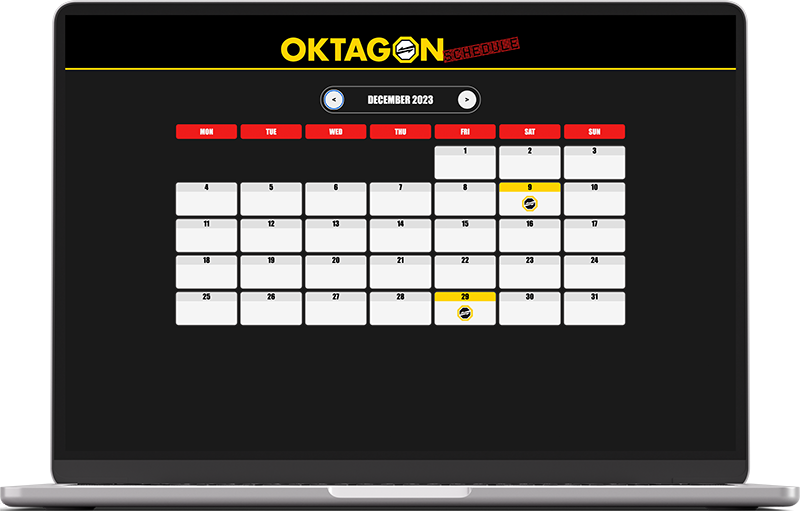
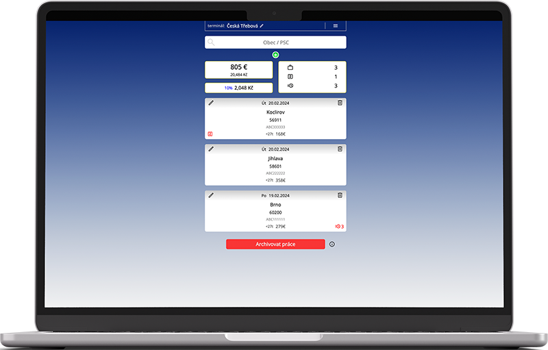

<h1 align="center">
    
</h1>

 

    <a href="https://gaz647.net/">www.gaz647.net</a>

 
 

    <a href="mailto:info@gaz647.net?subject=Message%20via%20profile%20on%20Github">info@gaz647.net</a>

 
 
 
 

    
    
    
    
    
    
    
    
    
    
    
    
    

 
 
 
 

    

 
 
 
 

    

 
 

# My projects

 

## emTruck v2.0

 
 

 
 

[github](https://github.com/gaz647/emTRUCK)

[emtruck.net](https://emtruck.net/)

 
 
 
 
 
 
 

<!--  -->

## Tátova Pila

 
 

 
 

[github](https://github.com/gaz647/tatova-pila_ts)

[tatovapila.cz](https://tatovapila.cz/)

 
 
 
 
 
 
 

<!--  -->

## gaz647

 
 

 
 

[github](https://github.com/gaz647/gaz647)

[gaz647.net](https://gaz647.net/)

 
 
 
 
 
 
 

<!--  -->

## Beneeto Hours

 
 

 
 

[github](https://github.com/gaz647/beneeto-hours_ts)

[beneeto-hours.netlify.app](https://beneeto-hours.netlify.app)

 
 
 
 
 
 
 

<!--  -->

## Oktagon Schedule

 
 

 
 

[github](https://github.com/gaz647/oktagon-schedule-ts)

[fancy-narwhal-e5080d.netlify.app](https://fancy-narwhal-e5080d.netlify.app/)

 
 
 
 
 
 
 

<!--  -->

## emTruck v1.0

 
 

 
 

<a href="" target="_blank">url</a>
[github](https://github.com/gaz647/emTRUCK_VUE)

[emtruck-v1.netlify.app](https://emtruck-v1.netlify.app/)

